<h2 align="center"><b>SideStream</b></h2>
<h4 align="center">Anime streaming app. A personal side project.</h4> 

## Screenshots

[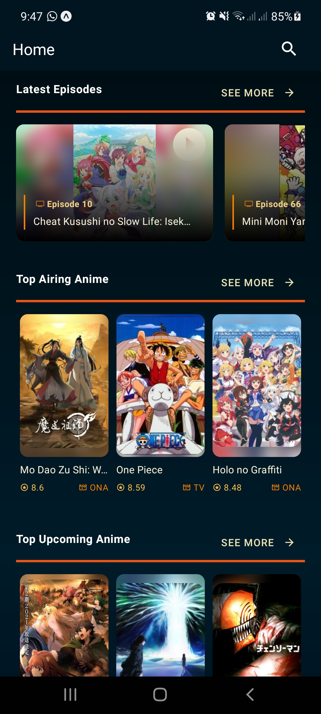](meta/screenshots/screenshot_1.jpg)
[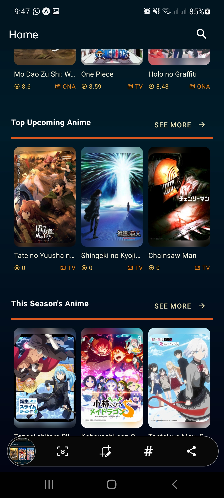](meta/screenshots/screenshot_2.jpg)
[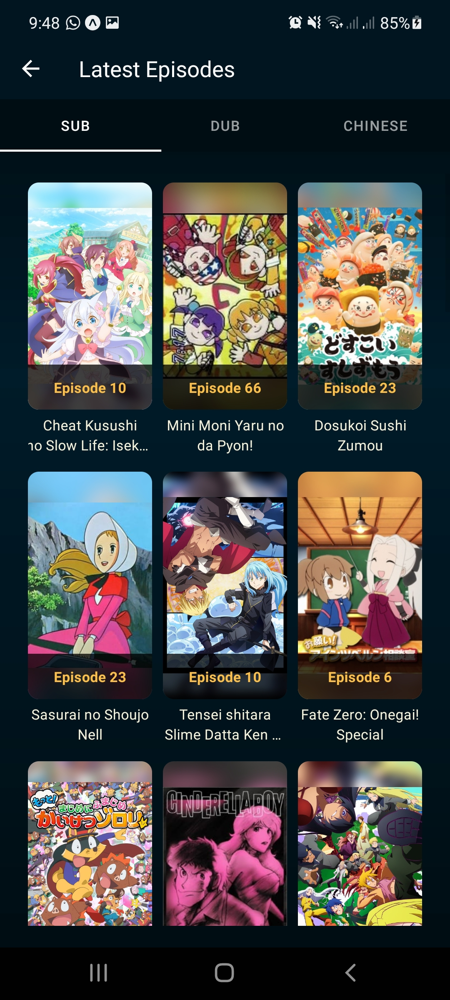](meta/screenshots/screenshot_3.jpg)
[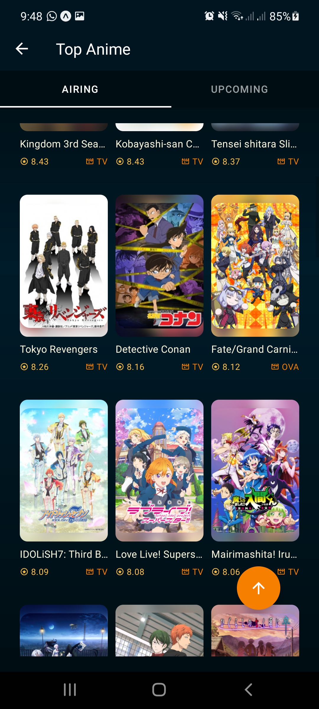](meta/screenshots/screenshot_4.jpg)
[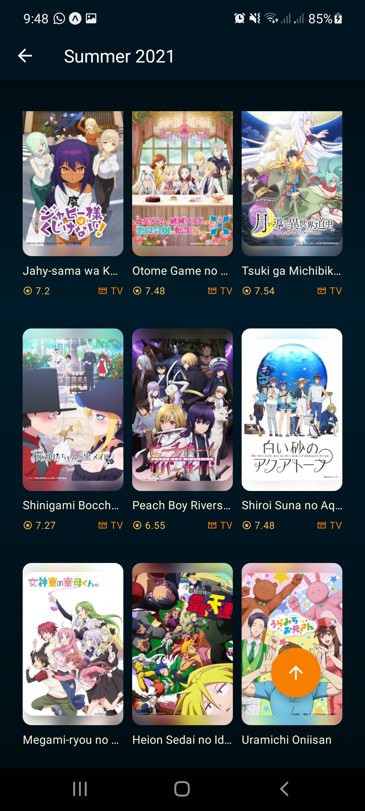](meta/screenshots/screenshot_5.jpg)
[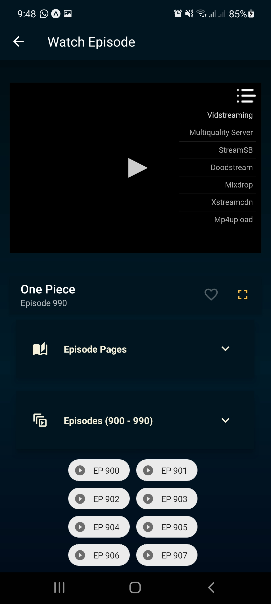](meta/screenshots/screenshot_6.jpg)
[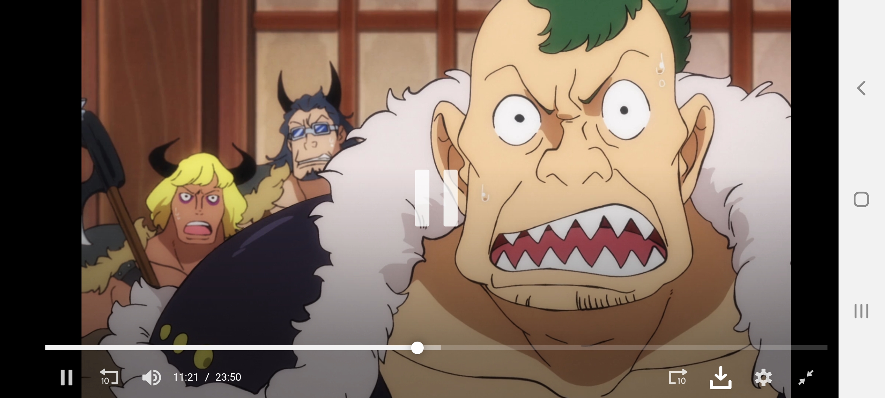](meta/screenshots/screenshot_7.jpg)
[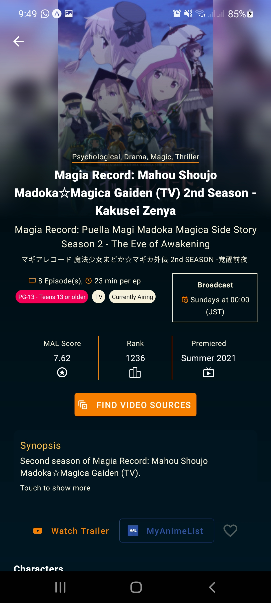](meta/screenshots/screenshot_8.jpg)
[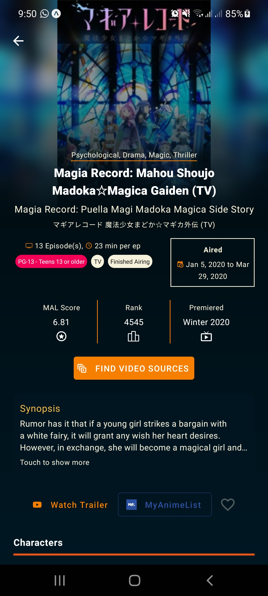](meta/screenshots/screenshot_9.jpg)
[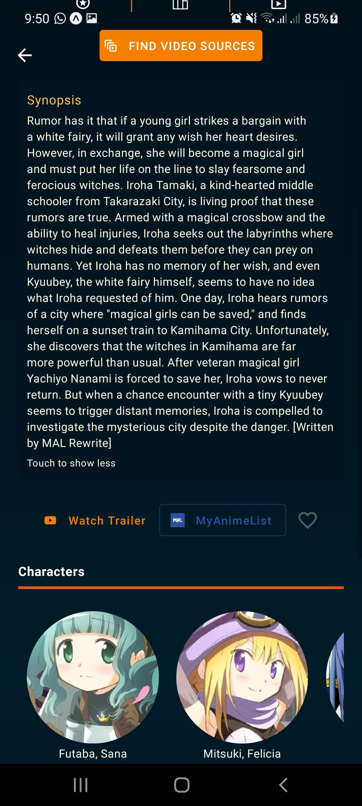](meta/screenshots/screenshot_10.jpg)
[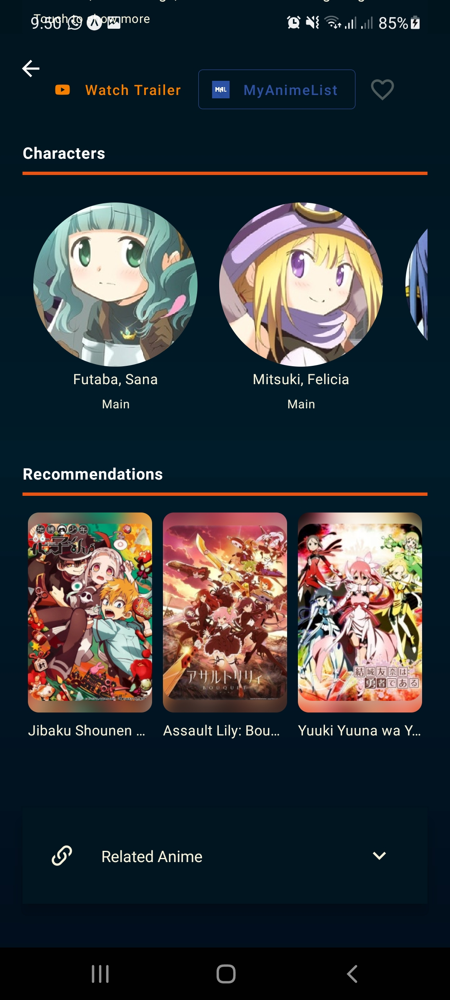](meta/screenshots/screenshot_11.jpg)
[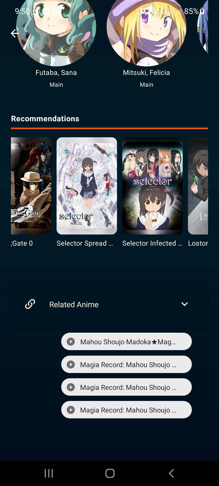](meta/screenshots/screenshot_12.jpg)

## Description

Retrieves content from the third party sources (MyAnimeList, Streamani.net, and GoGoAime); and makes them available to you.

### Features

* Search Anime
* Anime Details (including characters and related anime)
* Latest Anime Episodes
* Top Animes
* Current Season's Anime
* Stream anime

### Credits

* <a href="https://myanimelist.net/">MyAnimeList</a>
* <a href="https://jikan.moe/">Jikan API (UNOFFICIAL MYANIMELIST API)</a>
* <a href="https://gogoanime.pe/">GoGoAime</a>
* <a href="https://streamani.net/">Streamani</a>
* <a href="https://github.com/GyanendroKh/gogoanime-api">GoGoAnime API</a> (created by <a href="https://github.com/GyanendroKh)">GyanendroKh</a>)
* <a href="https://docs.expo.dev/">Expo</a>

### DISCLAIMER

I do not own any content made available through this app. All rights reserved to the copyright owners.
